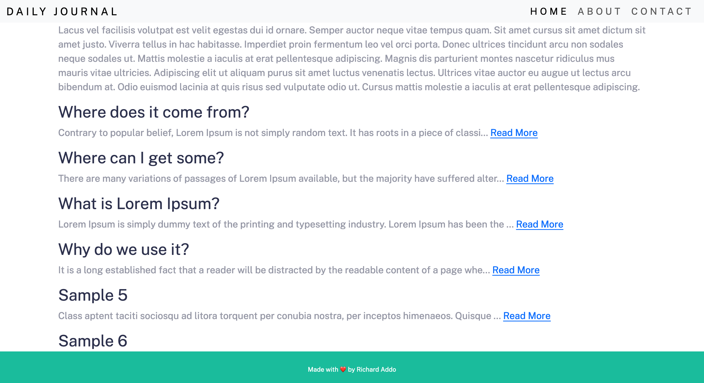

# Blog-site

## Table of contents

- [Overview](#overview)
  - [The challenge](#the-challenge)
  - [Screenshot](#screenshot)
  - [Links](#links)
- [My process](#my-process)

## Overview

Users will be able to:

- View the optimal layout for each of the website's pages depending on their device's screen size
- See hover states for all interactive elements on the page
- View each page and be able to toggle between the tabs to see new information
- View the full content of each blog on a different page

### Screenshot

### Links

- Live Site URL: [https://blogsite-tmdj.onrender.com](https://blogsite-tmdj.onrender.com)

## My process

### Built with

- Semantic HTML5 markup
- CSS custom properties
- Flexbox
- Bootstrap
- MongoDb
- Mongoose
- Node js
- EJS
